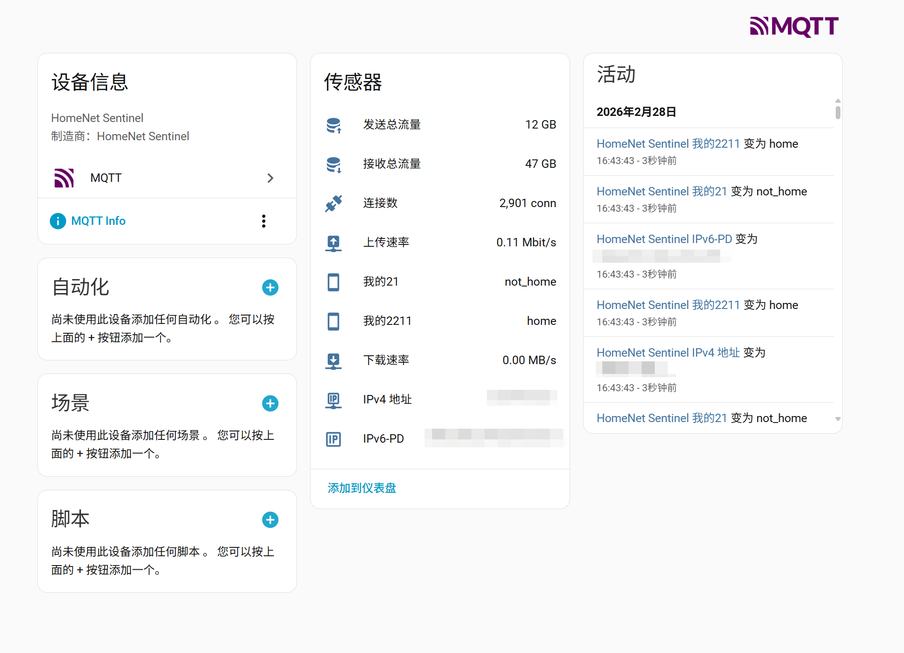
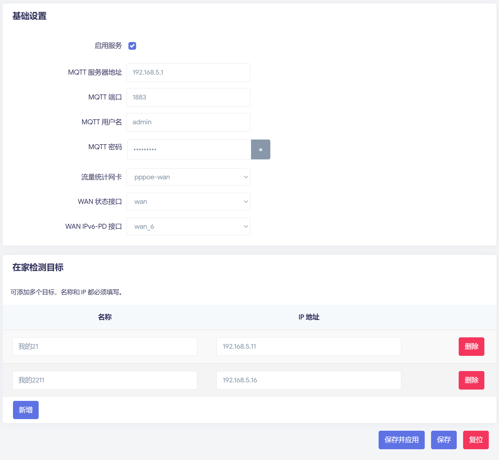

# HomeNet Sentinel

HomeNet Sentinel 是一个运行在 OpenWrt 上的家庭网络监控服务，支持：

- 基于 ARP/邻居表的在家检测（可配置多个目标 IP）
- 广域网流量与连接数采集（例如 `pppoe-wan`）
- 通过 MQTT 自动发现（Home Assistant MQTT Discovery）发布传感器
- 提供 LuCI 页面进行可视化配置

项目已包含 `luci-app-homenet-sentinel` 打包结构，可直接构建 `ipk` 安装包。

---

## 效果图

### Home Assistant 传感器样式



### OpenWrt / LuCI 页面效果



---

## 功能概览

### 1) 在家检测

- 支持多个目标（名称 + IP）
- 状态：`home` / `not_home`
- 结果发布到聚合主题，并自动注册为 HA 传感器

### 2) 广域网监控

- 下载速率（MB/s）
- 上传速率（MB/s）
- 连接数（conn，默认 30 秒发布一次）
- 接收总流量（GB，整数）
- 发送总流量（GB，整数）
- IPv4 地址
- IPv6-PD（来自 `wan_6` 的 `ipv6-prefix`）

### 3) MQTT / HA 集成

- 使用 MQTT retained 消息
- 自动注册 Home Assistant 实体

---


## 配置方式

通过 LuCI：`服务 -> 家庭网络哨兵`


说明：

- 接口与刷新项有默认值：
  - `wan_interface=pppoe-wan`
  - `wan_status_interface=wan`
  - `wan_ipv6_status_interface=wan_6`
  - `wan_rate_refresh_interval_seconds=3`（上传/下载刷新延迟）
- 连接数发送间隔固定为 30 秒，其他数据有变动即刷新
- MQTT 服务器和目标 IP 需手动配置

---

## 打包 IPK（ipkg-build）

### 1) 先编译二进制

打包前请先编译：

```sh
./build-aot.sh \
  HomeNetSentinel \
  HomeNetSentinel.csproj \
  linux-musl-x64 \
  $HOME/.build/HomeNetSentinel
```

默认产物路径：

- `$HOME/.build/HomeNetSentinel/out-musl/HomeNetSentinel`

如需使用预置路径，也可以将可执行文件放到：

- `package/luci-app-homenet-sentinel/prebuilt/HomeNetSentinel`

或在打包时通过 `--bin` 指定任意路径。

### 2) 执行打包

示例

```sh
./build_ipk.sh \
  --bin "$HOME/.build/HomeNetSentinel/out-musl/HomeNetSentinel" \
  --arch x86_64 \
  --version 1.0.0-0 \
  --output "$HOME/.build/HomeNetSentinel/" \
  --ipkg-build "$HOME/immortalwrt-sdk/immortalwrt-sdk-24.10.2-x86-64_gcc-13.3.0_musl.Linux-x86_64/scripts/ipkg-build"
```

### 3) 常用参数

- `--bin <path>`：指定 HomeNetSentinel 二进制
- `--arch <arch>`：包架构（如 `x86_64`）
- `--version <ver-rel>`：版本（如 `1.0.0-0`）
- `--output <dir>`：输出目录
- `--ipkg-build <path>`：指定 `ipkg-build` 路径

---


## MQTT 主题（主要）

- 聚合在家状态：`lan/presence/all`
- 可用性：`lan/presence/bridge/status`
- WAN 下载：`lan/presence/wan/<wan_if_id>/download_bps`
- WAN 上传：`lan/presence/wan/<wan_if_id>/upload_bps`
- WAN 连接数：`lan/presence/wan/<wan_if_id>/conntrack_count`
- WAN 接收总流量（GB）：`lan/presence/wan/<wan_if_id>/rx_gb_total`
- WAN 发送总流量（GB）：`lan/presence/wan/<wan_if_id>/tx_gb_total`
- WAN IPv4：`lan/presence/wan/<wan_if_id>/ipv4`
- WAN IPv6-PD：`lan/presence/wan/<wan_if_id>/ipv6_pd`

`<wan_if_id>` 由接口名转换（例如 `pppoe-wan`）。

---

## 故障排查

### 1) 安装报架构不兼容

检查目标设备架构：

```sh
opkg print-architecture
```

打包时 `--arch` 需与设备兼容。

### 2) HA 里仍显示旧目标

- 已删除目标可能是旧 retained discovery 残留
- 重启服务后新版本会自动清理；若仍残留，重载 MQTT 集成或重启 HA

### 3) 服务未启动

```sh
/etc/init.d/homenet-sentinel status
logread | grep homenet-sentinel
```

---

## 许可

本项目采用 `MIT` 许可证，详见 `LICENSE`。
